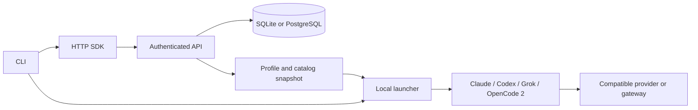

# Current delivery

Switcher **0.1.2 is published and installed**. [PR #1836](https://github.com/hasna/apps/pull/1836) merged reviewed source `61c0ca1b241043567bd7349a2810012db9c41b46` as `24681fa7552584c39c6bbcf7107faa6dd2f885e3` after all nine checks passed (the optional external review was skipped). npm publication at `2026-09-06T16:47:17.965Z` has SHA-1 `3952926c933700c8e5a56130bc3cb3c56bb01969`. All **50 installed package files** match the reviewed archive. The normal station `switcher`, `switcher-serve` and `switcher-mcp` commands resolve to 0.1.2; the previous installation and quarantine policy are preserved.

The normal station home now has reference-only bindings for the approved DeepSeek, OpenRouter and Gemini vault entries. Plain Claude/DeepSeek and Grok/DeepSeek launch dry-runs passed with three discovered models and no home override or external API supervisor. The exact previously tested Grok 1.0.13 binary was placed on the normal PATH; the four required native executables and Ori resolve there. Other native adapters retain explicit installation/executable prerequisites. This station readiness check made no new paid calls.

The release includes **14 native adapters, two optional Ori paths and 24 provider presets**, an HTTP API and typed `./sdk`, and SQLite/PostgreSQL self-hosting. It adds the missing adapters, corrects routing/argument authority and cleanup, preserves Gemini generation methods, bounds catalog retries, sanitizes reflected operator credentials in remote SDK errors, and supplies native installation guidance. Native harness installation and an approved provider credential remain prerequisites; Switcher owns provider/profile creation, automatic discovery and the local API lifecycle.

The published source passed **167 package tests / 1,799 assertions**, including real PostgreSQL and installed native opt-ins, **147 root tests / 560 assertions**, **43 affected builds**, frozen locks and generated/artifact/manifest/secret guards. Registry-installed Node 26.8.1 and Bun 1.3.14 CLI/API/SDK/server/standalone MCP checks pass. No Hasna MCP server was registered. The exact runtime bytes also passed both Compose storage backends, persistence, 0.1.1→0.1.2→0.1.1→0.1.2 and container recreation. Old 0.1.1 clients read preserved data but reject unsupported new harness writes and generation-method updates.

Registry live acceptance and native catalog observations are recorded in [COMPATIBILITY.md](COMPATIBILITY.md). The [evidence index](docs/verification-evidence.json) distinguishes published bytes from historical candidates and provider access limits. Evidence files live under `~/Workspace/scratch/universal-harness-switcher`; these are local provenance locators, not files included in the npm archive. The user's original `switcher-deepseek` session on `deepseek.sock` remains preserved.

The rejected archive `453bc3d6180a523286ab10f0a0154316cbf75672` was never published. Its SDK error reflection finding was corrected and independently rechecked before this release. Earlier baseline and 0.1.1 reports retain their original artifact identities; their provider observations are not relabeled as 0.1.2 registry tests.

Worktree owner: `codex-fixer`, task `01a07181-ca8d-70c1-99a2-b276dc5770f3`. Worktree: `~/Workspace/scratch/universal-harness-switcher/worktrees/complete-adapters`. Final evidence branch: `codex/fixer/2026-09-06-switcher-release-evidence`, based on fetched merge `24681fa7552584c39c6bbcf7107faa6dd2f885e3`. Implementation branch `codex/fixer/2026-09-06-switcher-expanded-adapters` is merged and preserved. The canonical checkout and other agents' worktrees remain untouched.

The Changesets release-plan API applied only `switcher-expanded-adapters`: 0.1.1→0.1.2. Its required package-to-bump front matter is the machine-format metadata exception; `release-candidate/expanded-scoped-release-plan.json` records the exact plan. Unrelated changesets were not applied. This documentation follow-up changes files excluded by the package's `files` allowlist; published runtime bytes remain immutable.

All 14 native adapters and both Ori paths passed the installed registry task/resume matrix. Remaining closure work is independent final evidence review and the documentation PR CI/merge, followed by the task/goal completion record. [TODOS.md](TODOS.md) retains stable IDs and separates completed implementation, external account/deployment prerequisites and optional product extensions. Missing provider access does not count as a passing live test. Native subscription/OAuth pooling, Bedrock/Vertex native cloud identity, cross-protocol translation and remote execution workers are explicit extensions, not silently supplied by compatible gateways.

# Original product plan and 0.1.0 provenance

# Product and acceptance

Build and publish `@hasna/switcher`, an API-backed CLI and typed `./sdk` for launching existing coding harnesses with a chosen provider and model. Claude Code, Codex, Grok Build, and OpenCode 2 are required in the first release. Show the selected provider's model catalog in each harness's native picker where its supported interface permits it. Ship genuine SQLite and PostgreSQL server storage, self-hosting artifacts, meaningful automated tests and live release verification in ephemeral tmux sessions.

The user explicitly authorized implementation, shipping, publication and live testing on 2026-09-05. This extends the earlier research-only scope. `TODOS.md` is the execution checklist. Raw directives are retained in the task's Workspace scratch directive records; this plan records agent interpretation rather than extending authority.

## Research and decisions

Three research helpers inspected todos, official harness documentation and primary GitHub projects. Local inspection found Ori 0.12.1, Claude Code 2.1.261, Codex 0.153.4 and OpenCode 2. Grok was not on PATH. Ori's harness inventory recognized Claude/Codex but not the station's `opencode2` executable. Provide explicit executable paths and version-aware adapters.

The unauthenticated OpenRouter model endpoint returned 431 default text entries and 582 across all output modalities on 2026-09-05. These counts are observations, never constants or proof of account access. Catalog discovery and successful agentic execution are separate acceptance checks.

| Reference | Finding | Decision |
| --- | --- | --- |
| [Ori](https://openrouter.ai/docs/guides/ori/harness) | Launches many existing harnesses with OpenRouter settings and argument passthrough. Its documented full catalog integrations vary by harness. | Use as product reference and optional adapter; no mandatory runtime dependency. |
| [CC Switch](https://github.com/farion1231/cc-switch) | Desktop profiles, SQLite, config management and local proxy. | Reference for profile usability; own HTTP API and SDK. |
| [Claude Code Router](https://github.com/musistudio/claude-code-router) | Multi-agent gateway, custom endpoints, discovery and routing. | Reference and optional upstream gateway. |
| [CLIProxyAPI](https://github.com/router-for-me/CLIProxyAPI) | Multiple compatibility protocols and a management API. | Optional separately operated translation backend. |
| [LiteLLM](https://github.com/BerriAI/litellm) | Broad provider API and self-hosted gateway. | Supported as a compatible upstream; do not reimplement a universal translator in the first release. |
| todos | Four surfaces, storage adapter seam and OpenAPI-generated client; legacy client paths and nontransactional PostgreSQL behavior also exist. | Reuse architecture selectively, with one API and transactional storage. |
| workflows | Existing harness lane abstraction and single service layer. | Avoid creating a second workflow scheduler; switcher owns provider/configuration/catalog launching. |

Ori is already installed; no duplicate installation is needed. Its public source repository and stable launcher SDK were not verifiable during research. Use documented launch interfaces only. Consumer subscription credential pooling is outside this product's first release.

## API, client and process boundaries

- `switcher`: human and automation CLI. All application data access is authenticated HTTP.
- `switcher-serve`: authenticated HTTP API, domain service and selected database adapter.
- `@hasna/switcher/sdk`: typed HTTP client without a database or process-launch dependency.
- `switcher-mcp`: required public package surface using the same API; never register a Hasna MCP server in the station's coding-agent configuration.
- Local launcher: consumes a validated launch plan, resolves provider credentials in memory and starts the local harness with argv arrays and process-scoped configuration.
- Optional gateway: compatible remote/local upstream. Native protocol pass-through comes first; translation must be explicit and tested.

A remotely hosted API does not execute commands on a user's laptop. Launch stays local. Native sessions and history remain owned by their harnesses. The service stores run metadata, not copied session databases.

A launch plan includes a content fingerprint of the provider, profile and catalog. Run creation validates that fingerprint transactionally and records provider/profile revisions, preventing stale configuration from starting after a concurrent edit.

Initial resources: `/v1/providers`, `/v1/providers/:id/models`, `/v1/profiles`, `/v1/launch-plans`, `/v1/runs`; public health/version and bounded readiness endpoints; an OpenAPI document. Generate SDK operation/type bindings from the specification and verify drift.

## Providers and model catalogs

A provider records endpoint, wire protocol, credential reference and nonsecret options. Initial protocol identifiers: Anthropic Messages, OpenAI Responses and OpenAI Chat Completions. OpenRouter is a preset, not a required provider. Preserve custom URL path prefixes. Never equate the two OpenAI protocols.

Catalog entries retain exact upstream ID, display name, description, modalities, context/output limits, supported parameters, provenance and refresh timestamp. Support pagination, authenticated catalog access, cache freshness and explicit manual entries when an endpoint has no discovery. Retain unknown capabilities in the API catalog. When a native schema requires complete fields, declare conservative native assumptions and warn; do not present these defaults as provider evidence.

Show the complete provider catalog in switcher, with explicit eligibility/compatibility information. Generate the harness picker from permitted compatible entries and explain native limitations. Do not silently substitute provider/model, truncate lists or claim an image/embedding model can run a coding loop. Refresh snapshots at launch; live reload is promised only where the harness supports it.

Model selection inside the harness must affect the model sent upstream on subsequent requests. Any gateway session credential binds to the provider and allowed model set, not solely to the starting model. Separate credential authority, model discovery and execution compatibility.

## Required first-release harnesses

| Harness | Connection and launch | Catalog integration |
| --- | --- | --- |
| Claude Code | Anthropic Messages via supported base URL/auth/model environment and launch settings. Preserve permissions. | Explicit `modelPicker` launch settings on supported versions; discovery alone filters IDs and can expose only a curated subset. |
| Codex | Responses-compatible custom provider using per-launch config. Preserve user home, approvals and sandbox. | Version-compatible startup `model_catalog_json`, or proven native catalog discovery. Include correct limits/reasoning metadata. |
| Grok Build | Official 1.0.13 binary. A per-launch authenticated loopback bridge uses supported remote catalog and API-key probe endpoints; forwards Messages, Responses or Chat unchanged. Native home and policies are preserved. | Remote entries carry readable provider aliases, exact upstream model IDs and backend metadata; credentials stay out of the native catalog cache. Fresh-process resume uses a new authenticated bridge and retains the selected profile model. Use `-- --resume SESSION_ID -p PROMPT` for headless continuation; interactive resume accepts typed input after loading but rejects an inline positional prompt. |
| OpenCode 2 | First-class `opencode2` executable and version-specific provider config; separate from legacy OpenCode. | Populate provider `models` configuration with exact IDs, limits and capabilities. Use private/standalone execution where necessary to avoid cross-session provider contamination. |

Native picker integration is not proof of tool use, streaming or context correctness. Anthropic explicitly does not support non-Claude models behind Claude Code gateways; report these combinations as experimental. Unknown/signed reasoning state must not be blindly replayed across providers. Preserve native resume where supported and reject unsupported resume combinations clearly.

Primary sources:
- [Claude model configuration](https://code.claude.com/docs/en/model-config)
- [Claude gateway discovery](https://code.claude.com/docs/en/llm-gateway-protocol#model-discovery)
- [Claude settings precedence](https://code.claude.com/docs/en/settings)
- [Claude gateway support boundary](https://code.claude.com/docs/en/llm-gateway)
- [Codex configuration](https://learn.chatgpt.com/docs/config-file/config-reference)
- [Codex advanced configuration](https://learn.chatgpt.com/docs/config-file/config-advanced)
- [Grok Build official source](https://github.com/xai-org/grok-build)
- [Grok Build changelog](https://x.ai/build/changelog)
- [OpenCode 2 providers](https://opencode.ai/v2/docs/providers)
- [OpenCode 2 models](https://opencode.ai/v2/docs/models)
- [Ori model catalog integration](https://openrouter.ai/docs/guides/ori/harness)
- [OpenRouter Claude integration](https://openrouter.ai/docs/cookbook/coding-agents/claude-code-integration)
- [OpenRouter Codex integration](https://openrouter.ai/blog/tutorials/codex-cli-openrouter/)
- [OpenRouter models API](https://openrouter.ai/docs/api/api-reference/models/list-all-models-and-their-properties)

## Storage and self-hosting

Use one domain store interface with actual SQLite and PostgreSQL implementations. Normalize providers, profiles, model snapshots and run metadata. Use parameterized SQL, transactions, optimistic concurrency as needed and migration versioning. SQLite is for one service instance with a persistent volume; PostgreSQL supports shared deployments. Run the same behavioral suite against both. Verify fresh startup, upgrade, rollback on failed transactions and restart persistence.

The existing canonical client contract assumes PostgreSQL server authority. The user's explicit SQLite requirement overrides that assumption for switcher. Document an app-scoped exception and keep all clients HTTP-only. Do not weaken global checks or silently revive local database fallbacks. Database credentials are server-only.

Supply a Dockerfile and SQLite/PostgreSQL compose profiles with persistence and health checks. Defaults bind to loopback unless explicitly configured for hosting. Select storage explicitly and fail startup on invalid/missing configuration.

## Credential and process handling

Store credential references only. On this fleet, resolve provider values through the approved secrets service and runtime injection; retain no plaintext copies. Public users may inject credentials through their supported process environment or secret manager. No values in argv, saved launch plans, JSON config, database rows, logs or source control.

Only forward required credentials to the selected harness. Validate remote API authority and provider destinations before attaching credentials; block redirects that could leak them. Use an allowlisted launcher command/config schema instead of arbitrary API-supplied shell execution. Redact diagnostic output and upstream auth errors. Keep transcripts disabled by default and preserve native permission behavior.

## Implementation sequence

1. Scaffold and record this plan; establish schemas, service API, SDK and dual storage.
2. Implement provider/catalog discovery and searchable selection.
3. Implement all four required launchers and native catalog adapters.
4. Verify direct provider and compatible gateway paths, model switching and credential isolation.
5. Build/package, independent exact-commit review, required repository checks and PR-first merge.
6. Publish the public npm release through the repository's vault-token/npmrc workflow.
7. Install the exact release in an isolated test location and verify API/SDK and all four real harnesses in ephemeral tmux sessions.
8. Record evidence, close completed checklist entries and retain any unfinished requirement explicitly.

## Verification and release

Automated tests must exercise real outcomes: API auth/error handling; CRUD and persistence for both databases; catalog pagination/metadata; SDK contract drift; invalid launch plans; argv/config generation; two simultaneous profiles; SSE and tool-call compatibility fixtures where proxying is implemented; model changes; signals and exit status; native settings preservation; credential redaction.

Live verification uses a task-owned tmux session and scratch directory, loopback service, temporary database and a minimal prompt. Record exact package/harness versions, provider and model, outcome, exit code, run IDs and sanitized evidence. Exercise each required harness through the built and then published switcher. Native picker visibility requires a direct UI or harness catalog verification in addition to inference success. Keep live prompts small and bounded; never expose credentials or disable harness protections. Stop only task-owned sessions/processes and retain useful evidence.

Run package typecheck/tests/build/contract checks and repository-required gates. Perform independent review against the exact implementation commit. Ship via branch and pull request; run staged secret scans before commits/pushes. Announce package/version in the required publishing channel, publish with npm from the package directory using protected token injection, verify registry version plus timestamp and test the exact registry artifact. Respect the global-install quarantine.

## Original 0.1.0 delivery record

- Owner: parent Codex task `01a07181-ca8d-70c1-99a2-b276dc5770f3`.
- Base commit: `c6a9fcf5a4825a9e49bab7b3ae688040726fcd61`.
- Branch: `codex/fixer/2026-09-05-universal-harness-switcher`.
- Implementation worktree: `~/Workspace/scratch/universal-harness-switcher/worktrees/implementation`.
- Existing canonical-checkout untracked files are preserved.
- Implementation shipped through [PR #1797](https://github.com/hasna/apps/pull/1797), merged as `b117b6bd95c1d374dec97ebe840dfef083025834`.
- Public [`@hasna/switcher@0.1.0`](https://www.npmjs.com/package/@hasna/switcher/v/0.1.0) was published at `2026-09-05T14:50:10.495Z`. Registry timestamp, tarball integrity and all 19 built-file hashes were verified.
- The exact registry release passed Node SDK/CLI/server/MCP smoke, all four native harness read-only tool loops on SQLite, and PostgreSQL with a second model. See `RELEASE.md` for evidence and limitations.
- Tracking task: `e0be8c8c-9588-4b7b-9996-382f113736e3`.
- Build, PR merge, publication and registry live acceptance are complete. Task/goal closure follows final evidence delivery. Optional product extensions and maintenance follow-ups remain explicit in `TODOS.md`.

## Completed 0.1.1 release verification

The reviewed 0.1.1 archive now passes installed OpenCode tool/resume and interactive full DeepSeek picker checks, exact Codex provider-catalog matching, Node/Bun public surface checks, and both container storage profiles with upgrade/rollback/re-upgrade preservation. PR #1810 subsequently passed CI, merged and published 0.1.1 at 2026-09-06T13:22:44.352Z. Registry identity and all seven installed live paths passed. This is the completed 0.1.1 record; the expanded 0.1.2 release is tracked above and below.

## Historical, superseded 0.1.2 candidate checkpoint

Before the SDK error-reflection finding, source `ef217dd749c4628bead0df43c4a83b3dc8d11468` produced the 49-file candidate `453bc3d6180a523286ab10f0a0154316cbf75672`. Its then-recorded checks were 152 package tests / 1,584 assertions, baseline native tasks/resume and Gemini's 54-model catalog with 40 eligible native IDs. Those observations remain historical evidence only. The archive was rejected and never published.

Reviewed source `61c0ca1b` and archive `3952926c` supersede that checkpoint. Their completed PR merge, publication, installed-registry acceptance and remaining documentation closure are recorded in Current delivery above. No earlier publication instruction in a historical snapshot authorizes republishing a rejected archive.
